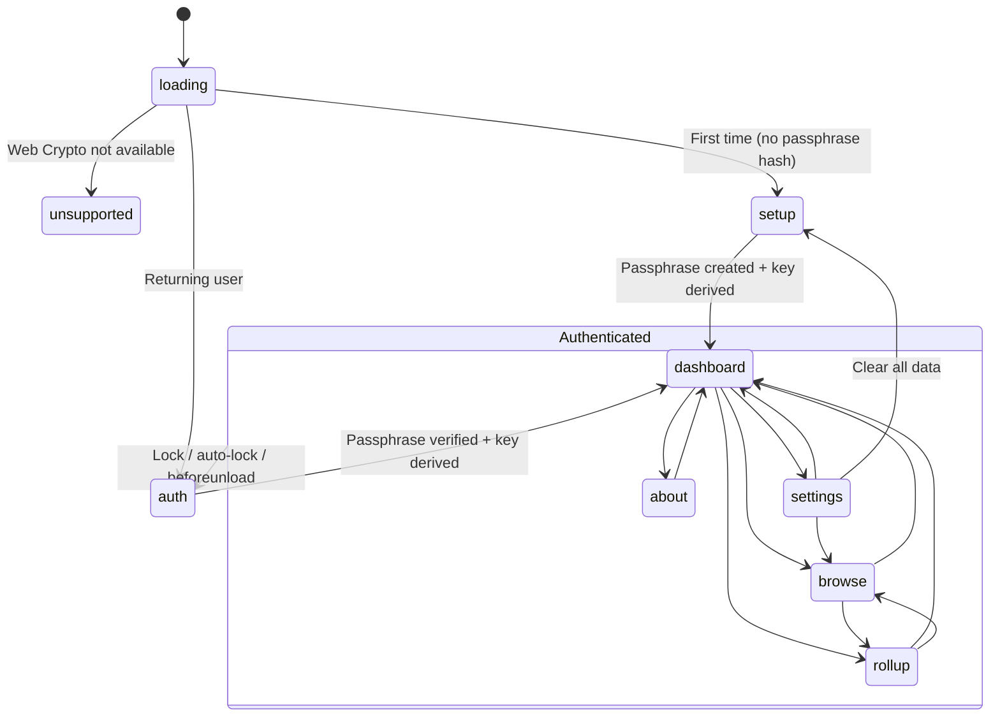

# Frontend Architecture

The entire application is a single Alpine.js component (`sdlcApp`) rendered within `index.html`. There is no routing library, no virtual DOM, and no component tree — Alpine.js directives in the HTML declaratively control what is visible based on the `view` state property.

## View State Machine

The application has a linear authentication flow and a flat navigation structure once authenticated. All state is managed in a single `Alpine.data('sdlcApp', ...)` object.

**Pre-auth states**: `loading`, `unsupported`, `setup`, `auth` — rendered via `<template x-if>` so they are fully removed from the DOM when inactive.

**Authenticated states**: `dashboard`, `browse`, `rollup`, `about`, `settings` — rendered via `
` with `x-transition` for smooth switching. These remain in the DOM but are hidden, which preserves scroll position and form state during navigation.

## Component Data Structure

The `sdlcApp` data object is organized into logical groups. Each group maps to a specific view or concern.

| Group | Key Properties | Purpose |
|-------|----------------|---------|
| State | `view`, `error`, `message`, `isProcessing` | Global UI state |
| Auth | `passphrase`, `passphraseConfirm`, `cryptoKey`, `isFirstTime` | Authentication flow |
| Dashboard | `todayDate`, `entryForm`, `hasEntryToday`, `recentEntries` | Daily entry form |
| Browse | `allEntryMetas`, `browseGroups`, `searchQuery`, `searchResults`, `selectedEntry`, `isEditing`, `editForm` | Entry browsing and search |
| Rollups | `rollupTab`, `availablePeriods`, `selectedPeriod`, `currentRollup`, `subReflections`, `reflectionText` | Period summaries |
| Settings | `storageEstimate`, `entryCount`, `showClearConfirm`, `clearConfirmText` | Data management |
| Session | `_lockTimer`, `_lastActivity`, `_failedAttempts`, `_lockoutUntil` | Auto-lock timing, rate limiting |

## CSS Design System

The stylesheet uses CSS custom properties for consistent theming. All colors, spacing, and radii are defined in `:root` variables.

**Color palette** (Warm & Grounded theme):

| Variable | Value | Usage |
|----------|-------|-------|
| `--navy` | `#2d2a2e` | Page background, input backgrounds |
| `--navy-light` | `#3a3640` | Card backgrounds, bottom nav |
| `--navy-lighter` | `#504a52` | Borders, dividers |
| `--slate` | `#9a8f85` | Secondary text, labels |
| `--slate-light` | `#c5b9a8` | Body text |
| `--lightest` | `#ede6d6` | Headings, primary text |
| `--white` | `#f5f0e8` | Alt. light background |
| `--accent` | `#8faa7b` | Interactive elements, links, highlights |

**SDLC category colors** — each journal category has a dedicated color set: a border/accent color, a WCAG AA-compliant text variant (4.5:1+ contrast against navy backgrounds), and a translucent background:

| Category | Border/Accent | Text (AA) | Background |
|----------|---------------|-----------|------------|
| Success | `#8faa7b` | `#a3c090` | `#8faa7b18` |
| Delight | `#d4a85c` | `#e0bc72` | `#d4a85c18` |
| Learning | `#7a9bb5` | `#93b5cb` | `#7a9bb518` |
| Compliment | `#c17c8e` | `#d592a3` | `#c17c8e18` |

**Typography**: Headings use Georgia (serif); body text uses the system sans-serif stack (`-apple-system, BlinkMacSystemFont, 'Segoe UI', Roboto, ...`).

## Responsive Layout

The app uses a mobile-first approach with two breakpoints.

| Breakpoint | Layout Change |
|------------|---------------|
| < 640px | Bottom navigation bar (fixed); desktop nav hidden; tighter padding |
| 640px+ | Desktop pill navigation bar; bottom nav hidden; wider padding |
| 968px+ | Maximum content width (900px); most generous padding |

The bottom navigation on mobile uses a 5-button icon layout (Journal, Browse, Rollups, About, Settings) that mirrors the desktop nav bar. The `x-cloak` attribute hides all Alpine.js content until initialization completes, preventing a flash of unrendered template syntax.

## Desktop UX (Electron)

The Electron app wraps the same web UI and adds native desktop features. These are wired via IPC from the main process to the Alpine.js component through `electron-bridge.js`.

**System tray**: A tray icon provides quick access without opening the full window. Right-click shows "Journal Today" (opens app at dashboard), "Lock Journal", and "Quit". Clicking the tray icon focuses the window.

**Native menu bar**: The app menu includes File (Save Entry, Lock Journal, Export Backup, Quit), Edit (standard text editing shortcuts), Window (Minimize, Close), and Help (About SDLC, Visit Circle 6 Systems, Check for Updates).

**Keyboard shortcuts** (via menu accelerators — active only when the app is focused):

| Shortcut | Action |
|----------|--------|
| Cmd/Ctrl+S | Save current entry |
| Cmd/Ctrl+L | Lock journal |
| Cmd/Ctrl+E | Export backup |
| Cmd/Ctrl+Q | Quit |

**Daily reminder**: At 5 PM local time, an OS notification prompts "Time to Journal". Clicking the notification focuses the app and navigates to the dashboard. The check runs on a 15-minute interval and only fires once per day.

**Native file dialogs**: In the desktop app, export uses the OS save dialog instead of a browser download. This is detected via `if (window.electronAPI)` in `storage.js`.

## Accessibility

The application targets WCAG 2.1 AA compliance across all views.

**Focus and keyboard operation**:
- `:focus-visible` outlines using the accent color with 2px offset; non-keyboard focus suppressed on buttons
- All interactive elements (including entry list items) have `role="button"`, `tabindex="0"`, and keyboard handlers for Enter and Space
- Focus moves to the heading of the destination view on navigation via `$nextTick`
- Bottom navigation buttons meet the 44×44px minimum touch target

**Screen reader support**:
- `.sr-only` utility class for visually hidden labels
- All `<textarea>` elements have programmatic `<label>` associations via `for`/`id`
- Period selector and search input have `sr-only` labels
- Error messages use `role="alert"` for immediate announcement
- Success messages use `role="status"` with `aria-live="polite"`
- DELETE ALL confirmation dialog has `role="alertdialog"` with `aria-label`

**Color and contrast**:
- Category label text uses WCAG AA-compliant color variants (`--success-text`, `--delight-text`, `--learning-text`, `--compliment-text`) that achieve 4.5:1+ contrast against navy backgrounds
- All primary text/background combinations meet AA thresholds

**Other**:
- `prefers-reduced-motion: reduce` disables all animations and transitions
- Navigation uses `<nav>` with `aria-label`
- Print styles: navigation, buttons, and footer hidden; colors adjusted for paper output
